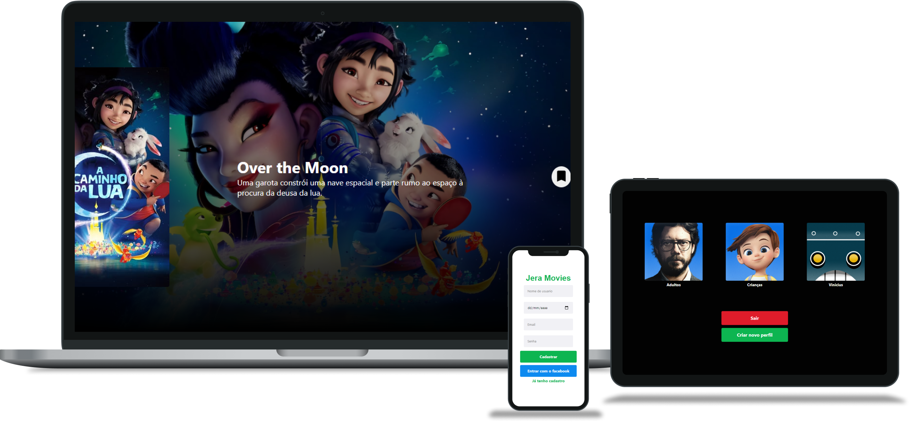

# Processo Seletivo Jera



Projeto foi realizado com base nas informações passadas pelo documento do desafio.

#### Video no YouTube
[https://www.youtube.com/watch?v=2WOIOCsnZjE](https://www.youtube.com/watch?v=2WOIOCsnZjE)

## Objetivo Geral

Desenvolver uma aplicação Web ou Mobile para o armazenamento de uma lista de filmes que o usuário gostaria de assistir. Essa lista deverá ser pega pela API do TheMovieDB [https://www.themoviedb.org/documentation/api](https://www.themoviedb.org/documentation/api).

Uma conta pode ser vinculada a mais de um perfil, sendo obrigatório ter ao menos um perfil vinculado.

A lista de filmes deverá estar associada ao perfil, não a conta, por exemplo: o perfil Filho deverá ter uma lista de filmes a assistir, já o perfil Mãe pode ter outros filmes a assistir (como funciona no Netflix).

## Funcionalidades

- [x] **Criar conta**
- [x] **Login da conta**
- [x] Login com rede social
- [x] Criar perfil
- [x] Listar perfis
- [ ] Lista de filmes sugeridos
- [x] **Busca de filmes**
- [x] **Marcar filme como para assistir**
- [x] **Visualizar lista para assistir**
- [x] Marcar como assistido
- [ ] Compartilhar filme assistido
- [ ] Agendar filme para assistir

## Instalação

```sh
$ git clone https://github.com/vinimachad/processo-seletivo-jera.git
```

Depois disso, instale as dependências do Front-end:

```sh
$ cd processo-seletivo-jera && yarn install # ou npm install
```

## Executando a aplicação

```sh
$ yarn start # ou npm start
```
